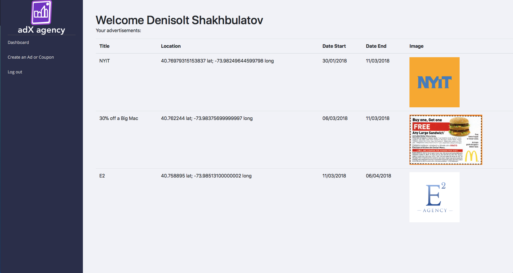
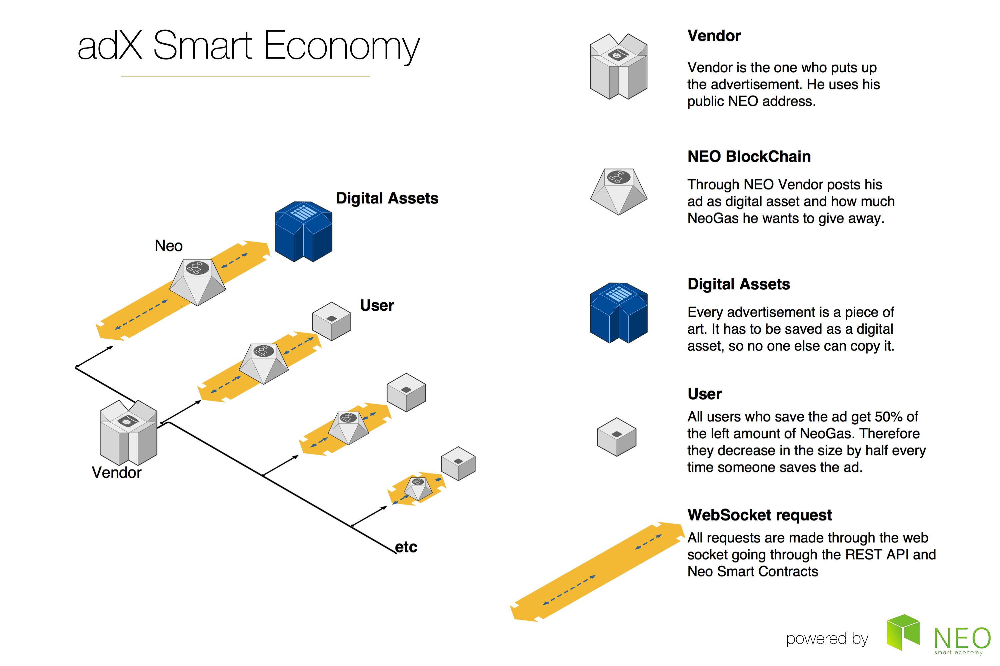

<p align="center">
    
</p>

<h1 align="center">adX</h1>

<p align="center">
    NEO smart contract for adX platform
</p>

## Overview

adX is a novel tool for vendors (cafes, restaurants, stores, etc) to engage people in collecting ads and coupons. adX is a geolocation based Augmented Reality mobile application on NEO. Vendors post their ads and how much NEO they want to share with users. Users have to go to specific location on map, open the app and click on the floating in augmented reality advertisement. 

Smart contracts are implemented for sharing the tokens with the adX users based fist come first serve.  First user will get 50% of vendors amount, second - 25%, third - 12.5% and so on.

- [Background](#background)
- [Script Hash](#script-hash)
- [Scope](#Scope)
- [Usage](#usage)
- [Documentation](#documentation)
- [Deploy](#deploy)
- [License](#license)
- [Investors](#investors)
- [Future](#future)

## adX consists of 3 parts:

- ### adX Web App:

  

- ### Android app with Augmented Reality, Mapbox and Firebase:

  ​

  ### 

- ### NEO blockchain:

  

  ​

## Background

The primary purpose of adX is to deliver a fun and secure way of collecting ads and distributing money to the winners. Despite the technological progress, advertisements stayed annoying and bothering users. With adX they became fun and engaging. 

#### The problem

In the past years with the growth of the data collection and machine learning, companies have done tremendous work in creating personalized advertisements. However, they are still annoying sitting on the pages of users favorite websites. People simply use Ad Blockers to protect themselves from the annoying personalized pop ups. 

#### The solution

With the sudden popularity of Pokemon Go. @aarora08 and @denisolt have realised that same engaging technology can be applied in the field of advertising as well. adX let's you collect coupons and ads just like pokemon Go. However, you also get paid! Using NEO Blockchain adX distributes the tokens to the users that collected the Ad, making ads fun for the first time!

## Script Hash

City of Zion testnet:

```

```

## Scope

#### Smart Contract

The Smart Contract will provide a trustless bridge between users and vendors, using blockchain technology built on the NEO Smart Economy to ensure that vendors can not scam the users and vendors ads and coupon stay as digital assets.

- Use a NEO public address as a digital identity
- User authorization
- Registration of users on the network
- Withdrawals of NeoGas during the acceptance of the ad

#### User

The user will be provided with an account with built-in crypto currency wallet. The wallet will hold NeoGas that the user has collected so far

- Web-based Python client
- Android App
- Open-source
- More in https://github.com/adX-agency/adx

#### Vendor

The vendor will have access to set of tools and knowledge to put up their ad on the blockchain.

- NeoGas Wallet with their digital assets (images of ads and coupons) and the amount of NeoGas they have left
- Web application
- Open-source
- More in https://github.com/adX-agency/adX-backend

#### Service

The ecosystem is friendly and engaging. With an Augmented Reality application users will not even think of annoying ads, while they are getting paid in the most fun scavenger hunt they have had so far. Simultaneously, vendors are capable of distributing their ads anywhere in the World for a lot cheaper!

Detailed usage explanation is described in [Documentation](#documentation).

## Usage

There are two types of users: vendors and customers. Vendors are the ones setting up the advertisements and coupons. Customers are the ones discovering them and getting rewarded. Function parameters and examples are explained below in [Documentation](#documentation).

### Seller Functions

* [`create`](#create) - create the ad
* [`delete`](#delete) - delete the ad

### Discover Functions

* [`discover`](#discover) - get rewarded for ad / save it

### Misc Functions

* [`details`](#details) - get all details of the ad

## Documentation

**Attention: functions cannot have spacing if started from neo-python. **

### `create`

* Example:

    > `testinvoke <contract_hash> create ['<creator_public_key>','McDonaldsAd','Opening-day-Big Mac 30% off!','Discount-for-meal-and-burger-alone',3,1546300800,5,8]`

    Here a new ad identified by `McDonaldsAd` is being created for the BigMac, promo expires on Jan 1, 2019 (1546300800 unix time). A vendor would typically be using this command.

* Parameters (in order):

    * **`creator_public_key`**: (public key)

        Owner of the ad's public key. This public key is checked to determine whether the wallet used to invoke has permission to `delete` or `discover` a promo after it has been created. `creator_public_key` is explicitly stated to give flexibility, eg creating a promo on behalf of the vendor.

    * **`promo_id`**: (str)

        Unique String. Can be timestamp, lat, long.

        **`title`**: (str)

        Title of your ad.

    * **`description`**: (str)

        Description and details of your ads.

    * **`price`**: (int)

        Price in gas.

    * **`expiration`**: (int)

        Date the ad expires, expressed in unix GMT time. Vendors can only claim funds after the date/time has passed. 


### `discover`

* Example:

    > `testinvoke <contract_hash> claim ['mypromocode']`

    Here a seller can claim funds from promo `McDonaldsAd` if the `min_count` and `expiration` is met. Funds can only be claimed if wallet's public key used to invoke matches the public key used in `create`.

* Parameters:

    * **`promo_id`**: (str)

        Desired ad to save and claim the tokens for.


## Deploy

To launch the web side of AdX:

```bash
git clone https://github.com/adX-agency/adX-backend.git
cd adX-backend
cd mysite
python3 manage.py runserver
```

To access the android app:

```bash
git clone https://github.com/adX-agency/adX.git
# open Android Studio and build an apk
# install the apk on your Android device#
```

neo-python commands to 

```
build coreadx.py test 0710 01 True False operation []
import contract contract.avm 0710 01 True False
```

## License

- adX is open-source under [MIT license](https://github.com/adX-agency/adx-blockchain/blob/master/LICENSE)
- Maintained by [Arshit Arora](http://github.com/aarora08),  [Denisolt Shakhbulatov](http://github.com/denisolt),  [Mahmoud Saleh](http://github.com/msdocs)


## Investors

Few advertisements firms already got a sneak peak of adX and they loved it. 

Pioneers of the ad business have given feedback stating that adX can revolutionize their business and bring in a lot more users.

Especially taking in consideration the development of Augmented Reality on the smaller wearable devices. 

## Future

- Implementation of Deep Learning techniques to replace the images of actual billboards in the streets with our elements. 
- Implementation of other functions in the smart contracts:
  - to ensure the coupon can be used once
  - to transfer coupons/ads to other people
  - to setup custom percentage of split to users
